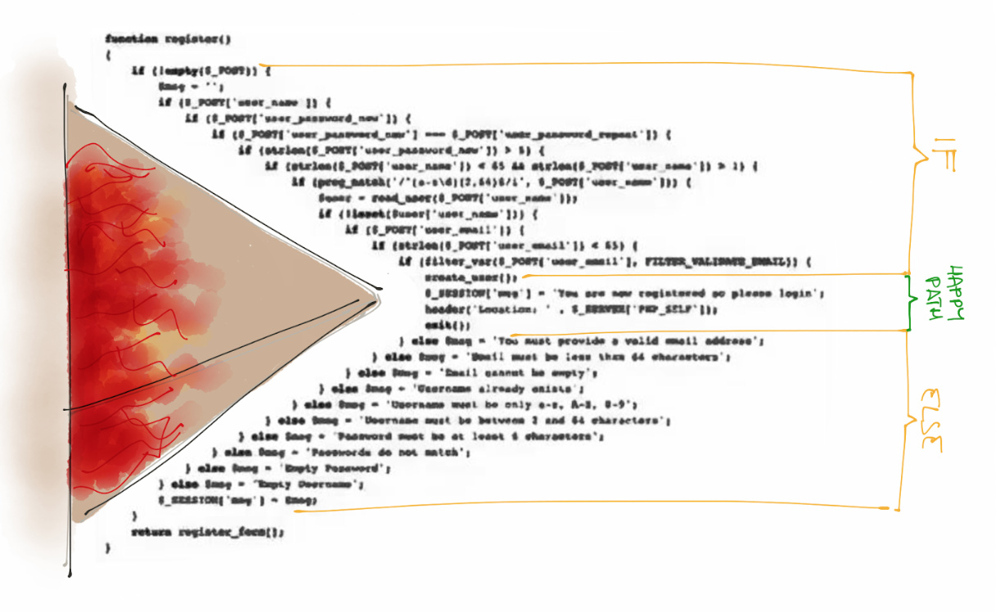
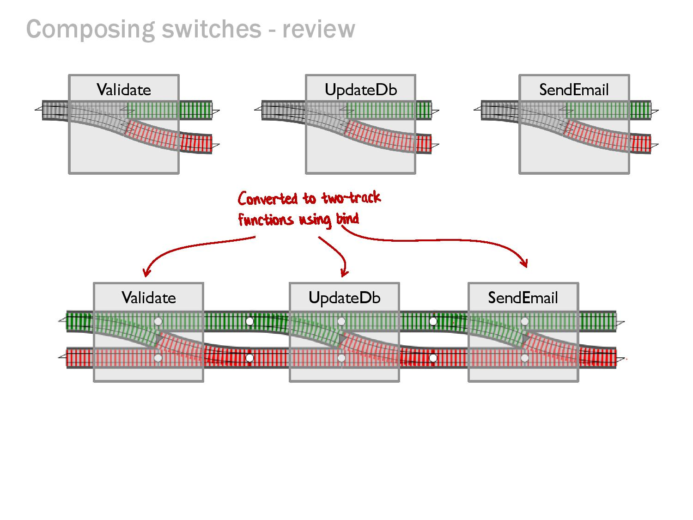

- title : language-ext
- description : Introduction to lanaguage-ext
- author : Skylark
- theme : night
- transition : default

***

### language-ext

- Pyramid of doom
- Primitive Obsession
- Validation
- Other features

' composability
' make illegal states unrepresentable
' dev we know, have taken all this with them to other jobs
' while should apple devs have all the fun
' fundamental design patters, universal abstractions
' my "trafalgar"
' more upfront work, less fixing
' single error type per subsystem

***

### Pyramid of Doom

***

### Railway Oriented Programming

***

### ROP in Code

    [lang=cs]
    var result =
        await ParseProfileIdOrValidationError(workflow.UserId)
        .BindAsync(uId => ValidateUserCanWriteToProfile(uId,
                            workflow.UserClaims)
        .Bind(_ => ValidateInputIsNotNull(workflow.InputModel))
        .Bind(_ => ValidateOnlyWhitelistedPropertiesAreSet(workflow.InputModel, uId,
                    workflow.UserClaims))
        .Bind(_ => ValidateUserDetailsInput(workflow.InputModel))
        .BindAsync(_ => CheckIfProfileExists(qs, uId, workflow))
        .BindAsync(_ => CheckUniqueFieldsForUpdate(qs, workflow.InputModel, uId,
                            workflow.UserClaims, workflow))
        .MapAsync(_ => MapModel(uId, workflow.ProfileFieldsToDelete))
        .MapAsync(CreateCommand));

    return result;

' LINQ Select, SelectMany

---

#### Workflow Method

    [lang=cs]
    public static Either<Error, Unit> ValidateUserCanWriteToProfile(UserId userId,
                                        UserClaims userClaims)
    {
        if (userClaims.IsAdmin == false
            && userClaims.IsUser(userId) == false
            && userClaims.ProfileRights.Write == false) return Errors.PermissionDenied;
        return unit;
    }

Honest functions with a common return type promote composability

' Isolate external dependencies to discrete functions, test honest functions independently

---

#### Interpreting the Result

    [lang=cs]
    ...

        return result.Match<IActionResult>(
            Right: success => new OkObjectResult(success),
            Left: ToResult);
    }

    private IActionResult ToResult(Error error)
    {
        return error.Match<IActionResult>(
            notfound => new NotFoundResult(),
            forbidden => new ForbidResult(),
            invalid => new BadRequestObjectResult(invalid),
            general => new InternalServerErrorResult());
    }

***

### Primitive Obsession

Using primitives to model domain types

    [lang=cs]
    var order = _service.GetOrderForUser(userId, orderId);

    ...

    public Order GetOrderForUser(Guid orderId, Guid userId);

---

#### NewType

    [lang=cs]
    public class OrderId 
    {
        public OrderId(string value) : base(value)
        {
        }
    }

    public class UserId : NewType<UserId, Guid>
    {
        public UserId(string value) : base(value)
        {
        }
    }

    public Order GetOrderForUser(OrderId orderId, UserId userId);

NewTypes are equatable, comparable and 'hashable'

---: NewType<OrderId, Guid>

#### Make invalid types unrepresentable

    [lang=cs]
    public class PrimitiveValidation : NewType<PrimitiveValidation, int>
    {
        private PrimitiveValidation(int val) : base(val)
        {
        }
        
        public static Validation<Error, PrimitiveValidation> Create(int val)
        {
            ...
        }            
    }

***

### Validation

    [lang-cs]
    Validation<ErrorType, SuccessType>

    return model.IsNotNull().Bind(_ =>
            model.HasValidId()
             | model.HasEmailOrSupporterNumber()
             | model.HasValidPrimaryEmail()
             | model.HasValidContactEmail()
             | model.HasValidParentEmail()
             | model.HasValidCountryCode()
             | model.HasValidDob()

Composable

---

#### Applicable

    [lang-cs]
    return (
            Latitude.Validate("1.23", "start lat"),
            Longitude.Validate(null, "start lon"))
        .Apply((lat, lon) =>
            new GeoLocation(lat, lon));

Make invalid states unrepresentable

***

### Other features

- Options
- Records
